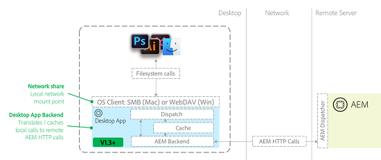

# AEM桌面应用程序v1.10最佳实践 {#aem-desktop-app-best-practices}

## 概述 {#overview}

[!DNL Adobe Experience Manager] 桌面应用程序将您的数字资产管理(DAM)解决方案链接到桌面，以便您可以直接在桌面上打开AEM Web UI中可用的文件。 如果从桌面保存资产，则会将该资产上传到相应位置的AEM。

AEM桌面应用程序消除了您在AEM中更新不正确的本地副本或更新错误资源的可能性。 通过使用桌面操作系统提供的网络共享技术，可以启用桌面应用程序易于使用的工作流。

桌面应用程序在桌面上将AEM Assets存储库作为网络共享挂载。 因此，文件夹和文件看起来就好像是本地文件夹和文件。 但是，不建议直接从桌面在Finder或Explorer中已装载的网络共享中执行数字资产管理操作。 Adobe建议您改用AEM Assets Web UI来执行操作，例如复制或移动大量资源。

>[!NOTE]
>
>在阅读本文档之前，您可以查看整个 [AEM和Creative Cloud集成最佳实践](https://experienceleague.adobe.com/docs/experience-manager-65/assets/administer/aem-cc-integration-best-practices.html) 以获取该主题的更高级别概述。

## AEM桌面应用程序架构 {#aem-desktop-app-architecture}

AEM桌面应用程序使用WebDAV (Windows)或SMB (Mac)网络共享来装载网络共享。 装载的网络共享仅供本地使用。 AEM桌面应用程序会截获调用（打开、读取、写入）并提供其他本地缓存。 它将对AEM Assets服务器的远程调用转换为优化的AEM HTTP请求。 下图描述了AEM桌面应用程序架构。

*图：桌面应用程序架构*

在保存文件时附加的写缓存会导致文件先在本地保存（这样用户就不会等待网络传输）。 然后，在预定义的延迟（30秒）后，将文件上传到后台的AEM，然后将资产上传到AEM。 AEM桌面应用程序提供了一个用于监控后台文件上传状态的UI。

## 推荐使用AEM桌面应用程序 {#recommended-use-of-aem-desktop-app}

AEM桌面应用程序的主要功能包括：

* **在桌面上从AEM Assets Web UI打开文件**. 从Web UI中，您可以显示桌面上的资产（在Finder、资源管理器中），或使用桌面应用程序打开资产。

* **签出和签入**. 可以将资源签出以进行编辑，在AEM Assets中，这些资源将标记为为用户锁定。 编辑后，可以签入资源以将其解锁。

* **将更改保存到文件**. 您保存到网络共享中文件的任何更改都会自动上传到AEM，并创建一个新版本。

* **将链接的资产放置在其他文档中**. 在应用程序中，例如Creative Cloud([!DNL Adobe Photoshop]， [!DNL Adobe InDesign]、和 [!DNL Adobe Illustrator])，您可以将外部文件作为链接放置。 例如，您可以将图像放入InDesign文档中。 在这种情况下，网络共享装载允许您浏览并从AEM中选择要放置的资源。 在某些非Adobe应用程序（如MS Office）中，放置链接文件也很有用。

* **AEM中的引用分辨率**. 如果置入的文件和带有链接的主文件都存储在AEM中，则可以自动提供有关资源引用的服务器端信息。

* **从桌面访问资产**. 在挂载的网络共享中，上下文菜单提供 [!UICONTROL More Info] 对话框（更大的预览、关键元数据）以及在AEM UI中打开资源的功能。

* **批量上传大型分层文件夹**. 如果您使用AEM UI中的创建>文件夹上传选项来上传资产，AEM桌面应用程序会在后台将选定的文件夹层次结构上传到AEM。 可以在桌面应用程序中使用专用UI监控上传进度。

## 不适当使用AEM桌面应用程序 {#inappropriate-use-of-aem-desktop-app}

* 请勿使用AEM桌面应用程序从桌面管理资产。 AEM桌面应用程序未构建为网络驱动器的替代应用程序。 请改用以下功能：

   * 用于数字资源管理（查找或共享资源、元数据以及复制或移动）的AEM Assets Web UI。

   * AEM桌面应用程序 [!UICONTROL Folder Upload] 上传大型分层文件夹。

* 不要将AEM桌面应用程序视为AEM Assets的“桌面同步”客户端。 在此，AEM桌面应用程序的主要优势在于，它提供对整个存储库的“虚拟”访问，并且桌面同步应用程序通常只同步属于一个用户的资产。 AEM桌面应用程序提供了一定程度的缓存和后台上传；但是，它与典型的“同步”应用程序的工作方式非常不同，例如Adobe Creative Cloud桌面应用程序或Microsoft OneDrive。

* 不要经常使用AEM桌面应用程序网络驱动器来保存资产。 所有保存操作都将传输到AEM Assets。 因此，直接在已装载的AEM Assets存储库中执行大量编辑操作是不切实际的。 直接在已挂载的存储库中编辑资产时，会用不相关的版本占用资产的时间线，并向服务器施加额外的开销。

* 请勿使用AEM桌面应用程序将大量数据从一个AEM实例迁移到另一个实例。 请参阅 [迁移指南](https://experienceleague.adobe.com/docs/experience-manager-65/assets/administer/assets-migration-guide.html) 规划和执行资产迁移。 相比之下，桌面应用程序 [支持批量上传](use-app-v1.md#bulkupload) 中首次出现大量资源 [!DNL Adobe Experience Manager].

## 适用于选定用例的Recommendations {#recommendations-for-selected-use-cases}

### 创意用户对资源的访问权限 {#access-to-assets-for-creative-users}

AEM桌面应用程序提供对整个DAM存储库的虚拟访问，对于桌面上的创意用户而言，在其桌面上查找并访问正确的资产可能会很复杂。 使用这些最佳实践简化操作。

* 使用AEM Assets Web UI中的协作功能，创意用户能够更直接地访问正确的资源。 其中一些功能包括共享文件夹或收藏集、提供智能收藏集（保存的搜索）或发送包含指向正确资产的指针的通知。 然后，创意用户可以使用Web UI中的桌面操作快速访问其桌面上的这些资产。

* 考虑对资产（访问控制）的正确权限，为创意用户简化DAM存储库的视图，基本上限制他们仅访问所需或感兴趣的资产：

   * 某些与创意用户无关的区域可能会被拒绝用于其用户组，以将其从视图中（也在桌面上）删除。

   * DAM中的大多数资产都是最终资产，不打算进行更改 — 这些资产对于创意用户应该是只读的。

   * 只有需要更改或修饰的资产才应为创意用户启用写功能。 某些组织使用AEM Projects及其创建的文件夹来托管仍受更改影响的资产。

### 搜索资源 {#searching-assets}

搜索要在桌面上打开的文件：

* 使用AEM Assets Web UI查找资源。 AEM Assets中的搜索不仅功能强大（搜索Facet、保存的搜索），它还提供了其他功能来查找合适的资源。 其中包括其他筛选器，如根据状态（批准、到期）、收藏集、任务、通知搜索资产的功能，以及与其他用户/组共享文件夹/收藏集。

* 找到资产后，使用AEM UI中的桌面操作在桌面上访问该资产。

### 更新使用AEM桌面应用程序打开的资源 {#updating-assets-opened-using-aem-desktop-app}

如果您在从AEM Assets映射到本地网络共享的位置直接编辑资源，则每次将资源保存到桌面上时，都会将该资源上传到AEM。 此外，AEM会创建一个版本并生成演绎版。

如果存储在AEM中的资源需要更新，请执行以下操作：

* 对象 **次要更新**，如批准流程中的次要修饰请求：

   * 签出文件并在桌面上将其打开。

   * 更新文件。

   * 保存更新的版本。 资产将更新，时间线将显示原始版本以进行比较。

* 对象 **主要更新**，例如需要很短的创意WIP周期的更改请求：

   * 使用“显示”选项在桌面上打开相应的文件夹。

   * 将文件复制到映射的AEM Assets共享以外的WIP文件夹中(例如，将文件复制到与Adobe Creative Cloud桌面应用程序同步的文件夹中)。

   * 处理文件并间歇性保存。 更改不会保存到AEM Assets。

   * 编辑完成后，移动、复制或保存从AEM映射的文件，以将其上传为新版本。

## 网络性能 {#network-performance}

用户能否获得良好的AEM桌面应用程序体验，很大程度上取决于其桌面应用程序与AEM服务器之间是否拥有良好、稳定的网络连接，以及服务器是否经过调优以获得良好性能，特别是在上传和更新资产方面。 这些建议适用于组织中的网络/IT团队。

### 网络注意事项 {#network-considerations}

要了解有关AEM Assets网络配置的最佳实践，请参阅 [如何批量迁移资产](https://experienceleague.adobe.com/docs/experience-manager-65/assets/administer/assets-migration-guide.html) 文档。 有助于为用户优化AEM桌面应用程序体验的一些重要方面包括：

* **使用正确配置的Dispatcher**. 使用AEM Dispatcher可提高安全性，并确保已针对以下内容对其进行配置： [与Dispatcher后的AEM的AEM桌面应用程序连接](install-configure-app-v1.md#connect-to-an-aem-instance-behind-a-dispatcher)

* **节省带宽**. 考虑关闭Mac上的Finder中的图标预览 — 在使用Finder浏览已装载的存储库时。 Finder会请求每个文件生成预览，并让桌面应用程序在本地下载和缓存资产。 请注意，在节省带宽的同时还会降低桌面版用户的用户体验，因此在使用大型资产和/或带宽受限的存储库时应该这样做。

>[!NOTE]
>
>要关闭图标预览，请在Finder中转到 [!UICONTROL View]，选择 [!UICONTROL View Options]，然后取消选中 [!UICONTROL Show icon preview] 选项。 这仅适用于当前文件夹 — 要将它设为默认值，请单击 [!UICONTROL Use as default] 选项。

### 优化服务器性能 {#optimizing-server-performance}

要了解应如何优化AEM Assets服务器的性能，请参阅 [AEM Assets Performance Tuning指南](https://experienceleague.adobe.com/docs/experience-manager-65/assets/administer/performance-tuning-guidelines.html). AEM桌面应用程序服务器性能的一些重要方面与优化工作流配置有关，以便它在资源上传时性能良好：

* **性能更高的资产上传**. 配置 [AEM资产更新工作流模型为瞬态模型](https://experienceleague.adobe.com/docs/experience-manager-65/assets/administer/performance-tuning-guidelines.html).

* **限制用于上载的服务器CPU**. 确保正确设置了最大并行工作流作业参数，以便上传不会耗尽所有CPU。
