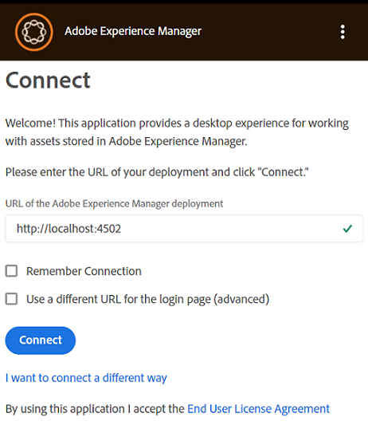
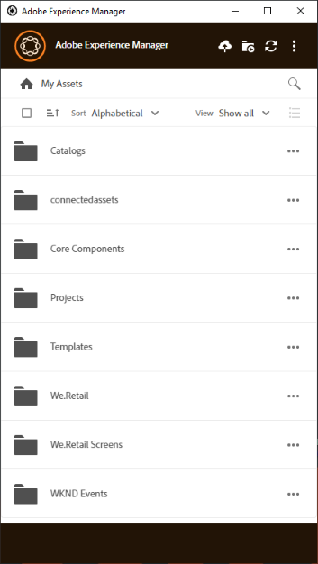

# 安装 [!DNL Adobe Experience Manager] 桌面应用程序 {#install-app-v2}

使用 [!DNL Adobe Experience Manager] 桌面应用程序，中的资产 [!DNL Experience Manager] 可在本地桌面上轻松使用，并可用于任何本地桌面应用程序。 可以预览资产、在本机桌面应用程序中打开资产、在Mac Finder或Windows资源管理器中显示资产以放置在其他文档中，以及在本地更改资产 — 更改将保存回 [!DNL Experience Manager] 上传并在存储库中创建新版本时。

通过此类集成，组织中的各种角色可以：

* 在中集中管理资产 [!DNL Experience Manager Assets].

* 访问任何本机桌面应用程序(包括第三方应用程序和Adobe Creative Cloud中的资源)中的资源。 同时，用户可以轻松遵守包括品牌推广在内的各种标准。

使用 [!DNL Experience Manager] 桌面应用程序：

* 确保您的 [!DNL Experience Manager] 版本受支持 [!DNL Experience Manager] 桌面应用程序。 请参阅 [系统要求](release-notes.md).

* 下载并安装应用程序。 参见 [安装桌面应用程序](#install-v2) 下面的。

* 使用一些资源测试连接。 参见 [如何浏览和搜索资源](using.md#browse-search-preview-assets).

## 系统要求、先决条件和下载链接 {#tech-specs-v2}

欲了解详细信息，请参见 [[!DNL Experience Manager] 桌面应用程序发行说明](release-notes.md).

## 从以前的版本升级 {#upgrade-from-previous-version}

如果您是桌面应用程序v1.x的用户，请了解该应用程序之前版本与最新版本之间的区别和相似之处。 参见 [桌面应用程序的新增功能](introduction.md#whats-new-v2) 和 [应用程序的工作原理](release-notes.md#how-app-works).

>[!NOTE]
>
>两个版本的桌面应用程序不能共存于计算机上。 在安装版本之前，请卸载其他版本。

要从应用程序的早期版本升级，请按照以下说明操作：

1. 升级之前，请同步所有资产并将更改上传到 [!DNL Experience Manager]. 这是为了避免在卸载应用程序时丢失任何编辑。

1. 卸载应用程序的早期版本。 卸载时，选择选项以清除缓存。

1. 重新启动计算机。

1. [下载](release-notes.md) 和 [安装](#install-v2) 最新的应用程序。 按照下面的说明操作。

## 安装 {#install-v2}

要安装桌面应用程序，请执行以下步骤。 卸载任何现有Adobe [!DNL Experience Manager] 桌面应用程序v1.x。 有关更多信息，请参阅上文。

1. 从下载最新的安装程序 [发行说明](release-notes.md) 页面。

1. 保留的URL和凭据 [!DNL Experience Manager] 部署方便。

1. 如果您从其他版本的应用程序升级，请参阅 [升级桌面应用程序](#upgrade-from-previous-version).

1. 如果您使用的是，请跳过此步骤 [!DNL Experience Manager] as a [!DNL Cloud Service]， [!DNL Experience Manager] 6.4.4或更高版本，或者 [!DNL Experience Manager] 6.5.0或更高版本。 确保您的 [!DNL Experience Manager] 设置符合 [发行说明](release-notes.md). 如有必要，请下载适用的 [兼容包](https://experience.adobe.com/#/downloads/content/software-distribution/en/aem.html?package=/content/software-distribution/en/details.html/content/dam/aem/public/adobe/packages/cq640/featurepack/adobe-asset-link-support) 并使用安装 [!DNL Experience Manager] 包管理器作为 [!DNL Experience Manager] 管理员。 要安装包，请参阅 [如何使用包](https://experienceleague.adobe.com/docs/experience-manager-65/administering/contentmanagement/package-manager.html).

1. 执行安装程序二进制文件，并按照屏幕上的说明进行安装。

1. 在Windows上，安装程序可能会提示安装 `Visual Studio C++ Redistributable 2015`. 按照屏幕上的说明进行安装。 如果安装失败，则手动安装。 安装程序下载来源 [此处](https://www.microsoft.com/en-us/download/details.aspx?id=52685) 并安装两者 `vc_redist.x64.exe` 和 `vc_redist.x86.exe` 文件。 重新运行 [!DNL Experience Manager] 桌面应用程序安装程序。

1. 根据提示重新启动计算机。 启动并配置桌面应用程序。

1. 要连接应用程序与 [!DNL Experience Manager] 存储库中，单击任务栏中的应用程序图标并启动应用程序。 提供 [!DNL Experience Manager] 服务器格式 `https://[aem_server]:[port]/`.

   单击 **[!UICONTROL Connect]** 并提供凭据。

   

   *图：输入服务器地址的连接屏幕。*

   选择 **[!UICONTROL Remember Connection]** 以避免在每次登录桌面应用程序时都输入连接详细信息。

   >[!CAUTION]
   >
   >确保的地址之前或之后没有前导或尾随空格 [!DNL Experience Manager] 服务器。 否则，应用程序无法连接到 [!DNL Experience Manager] 服务器。

1. 成功连接后，您可以查看的根文件夹中可用的文件夹和资产列表 [!DNL Experience Manager] 达姆。 您可以在应用程序中浏览文件夹。

   

   *图：应用程序在登录后显示DAM内容*

1. ([!DNL Experience Manager] 6.5.1或更高版本)如果您要将桌面应用程序与 [!DNL Experience Manager] 6.5.1或更高版本，请将S3或Azure连接器升级到版本1.10.4或更高版本。 参见 [Azure连接器](https://experienceleague.adobe.com/docs/experience-manager-65/deploying/deploying/data-store-config.html#azure-data-store) 或 [S3连接器](https://experienceleague.adobe.com/docs/experience-manager-65/deploying/deploying/data-store-config.html#amazon-s-data-store).

   如果您是Adobe Managed Services (AMS)客户，请联系Adobe客户支持。

## 设置首选项 {#set-preferences}

要更改首选项，请单击  和 **[!UICONTROL Preference]** . 在 **[!UICONTROL Preferences]** 窗口中，调整以下各项的值：

* [!UICONTROL Launch application on login]。

* [!UICONTROL Show window when application starts]。

* **[!UICONTROL Cache Directory]**：应用程序的本地缓存位置（包含本地下载的资产）。

* **[!UICONTROL Network Drive Letter]**：用于映射到 [!DNL Experience Manager] 达姆。 如果您不确定，请勿更改此设置。 该应用程序可以映射到Windows上的任何驱动器号。 如果两个用户从不同的驱动器号放置资产，则他们看不到彼此放置的资产。 资源的路径会发生变化。 资产仍放置在二进制文件（例如INDD）中，并且不会被删除。 应用程序会列出所有可用的驱动器盘符，默认使用最后一个可用的盘符，通常 `Z`.

* **[!UICONTROL Maximum Cache Size]**：硬盘上允许的缓存（以GB为单位），用于存储本地下载的资产。

* **[!UICONTROL Current cache size]**：本地下载的资产的存储大小。 仅当使用应用程序下载资产后，才会显示信息。

* **[!UICONTROL Automatically download linked assets]**：如果您下载原始文件，则将自动获取放置在支持的本机Creative Cloud应用程序中的资源。

* **[!UICONTROL Maximum number of downloads]**：  改变时请小心。 首次下载资源时（通过“显示”、“打开”、“编辑”、“下载”或类似选项），仅当批次包含的内容少于此数字时才会下载资源。 默认值为 50。如果您不确定，请勿更改。 增加值可能导致等待时间较长而减少值可能不允许您一次性下载必要的资源或文件夹。

* **[!UICONTROL Use legacy conventions when creating nodes for assets and folders]**：  改变时请小心。 此设置允许应用程序在上传文件夹时模拟v1.10应用程序行为。 在v1.10中，在存储库中创建的节点名称会遵循用户提供的文件夹名称的空格和大小写。 但是，在应用程序的v2.1中，文件夹名称中的额外空格将转换为破折号。 例如，上传 `New Folder` 或 `new   folder` 如果未选择选项并保留v2.1中的默认行为，则在存储库中创建相同的节点。 如果选择此选项，则会在存储库中为上述两个文件夹创建不同的节点，并且与v1.10应用程序的行为相匹配。

  v2.1的默认行为将保持不变，即，将文件夹名称中的多个空格替换为存储库节点名称中的破折号，并转换为小写节点名称。

* **[!UICONTROL Upload Acceleration]**：  改变时请小心。 上传资产时，应用程序可以使用并发上传来提高上传速度。 您可以通过向右移动滑块来提高上传的并发性。 最左侧的滑块表示无并发（单线程上传），中间位置对应于10个并发线程，最右侧的限制最大对应于20个并发线程。 并发限制越高则资源密集程度越高。

要更新不可用的首选项，请注销 [!DNL Experience Manager] 然后更新。 更新首选项后，单击 .


*图：桌面应用程序首选项。*

### 代理支持 {#proxy-support}

[!DNL Experience Manager] 桌面应用程序使用系统的预定义代理通过HTTPS连接到Internet。 应用程序只能使用不需要额外身份验证的网络代理进行连接。

如果配置或修改Windows代理服务器设置（“Internet选项”>“局域网设置”），请重新启动 [!DNL Experience Manager] 桌面应用程序，以使更改生效。 代理配置将在您启动桌面应用程序时应用。 关闭并重新启动应用程序，以使任何更改生效。

如果您的代理需要身份验证，IT团队可以允许 [!DNL Experience Manager Assets] 代理服务器设置中的URL，以允许应用程序流量通过。

## 卸载应用程序 {#uninstall-the-app}

要在Windows上卸载应用程序，请执行以下步骤：

1. 将所有更改上传到 [!DNL Experience Manager] 以免丢失任何编辑。 参见 [编辑资源并将更新的资源上传到 [!DNL Experience Manager]](using.md#edit-assets-upload-updated-assets). 注销和 [!UICONTROL Exit] 应用程序。

1. 删除应用程序，因为您删除了任何其他操作系统应用程序。 从Windows上的“Add and remove programs（添加和删除程序）”中卸载它。

1. 要删除缓存和日志，请选中必要的复选框。

   

1. 按照屏幕上的说明操作。 完成后，重新启动计算机。

要在Mac上卸载应用程序，请执行以下步骤：

1. 将所有更改上传到 [!DNL Experience Manager] 以免丢失任何编辑。 参见 [编辑资源并将更新的资源上传到 [!DNL Experience Manager]](using.md#edit-assets-upload-updated-assets). 注销和 [!UICONTROL Exit] 应用程序。

1. 删除 `Adobe Experience Manager Desktop.app` 起始日期 `/Applications`.

或者，要清理Mac上的内部应用程序缓存并卸载应用程序，您可以在终端中执行以下命令：

```shell
/Applications/Adobe Experience Manager Desktop/Contents/Resources/uninstall-osx/uninstall.sh
```
