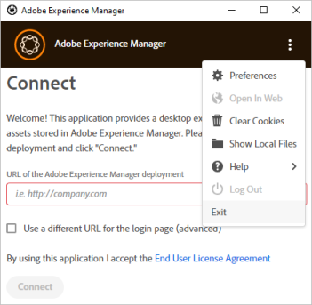

# 疑难解答 [!DNL Adobe Experience Manager] 桌面应用程序 {#troubleshoot-v2}

[!DNL Adobe Experience Manager] 桌面应用程序连接到 [!DNL Experience Manager] 部署的数字资产管理(DAM)存储库。 该应用程序可获取您计算机上的存储库信息和搜索结果、下载和上传文件和文件夹，并包含用于管理与Assets用户界面冲突的功能。

请阅读并了解应用程序故障排除、最佳实践和限制。

## 最佳实践 {#best-practices-to-prevent-troubles}

请遵循以下最佳实践，防止出现一些常见问题和疑难解答。

* **了解桌面应用程序的工作方式**：在开始使用应用程序之前，请花一些时间了解应用程序的工作方式。 了解之间的链接 [!DNL Experience Manager] Web界面和桌面、存储库映射、资产缓存、本地保存和后台上传。 参见 [工作原理](release-notes.md#how-app-works).

* **避免在文件夹名称中使用不受支持的字符**：创建或上传文件夹时，请勿使用空格和无效字符。 请参阅以下位置的字符列表 [在中创建文件夹 [!DNL Experience Manager Assets]](https://experienceleague.adobe.com/docs/experience-manager-65/assets/managing/manage-assets.html#creating-folders). 部分 [!DNL Experience Manager] 用例可能受文件夹名称中不支持的字符影响。

* **避免冲突的最佳做法**：要避免在协作处理多个资产时出现潜在冲突，请参阅 [避免编辑冲突](using.md#adv-workflow-collaborate-avoid-conflicts).

* **对大型分层文件夹使用文件夹上载**：不要使用Assets Web界面或其他方法，而应使用 [!DNL Experience Manager] 桌面应用程序，用于上传大型文件夹。 应用程序在后台使用日志记录和监控上传资产。 参见 [批量上传资产](using.md#bulk-upload-assets).

* **使用最新版本**：使用最新的应用程序版本，并始终在安装新应用程序版本之前或升级到较新版本之前检查兼容性 [!DNL Experience Manager] 版本。 参见 [发行说明](release-notes.md).

* **使用相同的驱动器号**：在组织内使用相同的驱动器号来映射到 [!DNL Experience Manager] 达姆。 要查看其他用户放置的资源，路径必须相同。 使用相同的驱动器号可确保到DAM资产的固定路径。 即使不同的用户使用不同的驱动器号，资产仍会放置且不会被删除。

* **关注网络**：网络性能对于 [!DNL Experience Manager] 桌面应用程序的性能。 如果您遇到文件传输或批量操作响应速度变慢的问题，请关闭可能导致大量网络流量的功能或应用程序。

* **桌面应用程序不支持的用例**：请勿将应用程序用于资产迁移（它需要规划和其他工具）；请勿将应用程序用于繁重的DAM操作（例如移动大型文件夹、大型上传、使用高级元数据搜索查找文件）；请勿将应用程序用作同步客户端(设计原则和使用模式不同于Microsoft OneDrive或Adobe Creative Cloud桌面同步等同步客户端)。

* **超时**：目前，桌面应用程序没有可配置的超时值，因此无法断开两者之间的连接 [!DNL Experience Manager] 固定时间间隔后的服务器和桌面应用程序。 上传大型资产时，如果连接在一段时间后超时，应用程序会通过增加上传超时来重试上传资产几次。 没有更改默认超时设置的推荐方法。

## 如何进行故障排除 {#troubleshooting-prep}

要排查桌面应用程序问题，请注意以下信息。 此外，如果您选择寻求支持，您还可以通过它向Adobe客户支持部门更好地传达问题。

### 日志文件的位置 {#check-log-files-v2}

[!DNL Experience Manager] 桌面应用程序会根据操作系统将其日志文件存储在以下位置：

在Windows上： `%LocalAppData%\Adobe\AssetsCompanion\Logs`

在Mac上： `~/Library/Logs/Adobe\ Experience\ Manager\ Desktop`

上传许多资产时，如果某些文件上传失败，请参阅 `backend.log` 文件来标识失败的上传。

>[!NOTE]
>
>在支持请求或票证上与Adobe客户支持部门合作时，可能会要求您共享日志文件，以帮助客户支持团队了解此问题。 存档整个 `Logs` 文件夹并将其与客户支持联系人共享。

### 更改日志文件中的详细信息级别 {#level-of-details-in-log}

要更改日志文件中的详细信息级别，请执行以下操作：

1. 确保应用程序未运行。

1. 在Windows系统上：

   1. 打开命令窗口。

   1. Launch [!DNL Adobe Experience Manager] 通过运行以下命令获得桌面应用程序：

   ```shell
   set AEM_DESKTOP_LOG_LEVEL=DEBUG&"C:\Program Files\Adobe\Adobe Experience Manager Desktop.exe
   ```

   在Mac系统上：

   1. 打开终端窗口。

   1. Launch [!DNL Adobe Experience Manager] 通过运行以下命令获得桌面应用程序：

   ```shell
   AEM_DESKTOP_LOG_LEVEL=DEBUG open /Applications/Adobe\ Experience\ Manager\ Desktop.app
   ```

有效的日志级别为DEBUG、INFO、WARN或ERROR。 日志的详细程度在DEBUG中最高，在ERROR中最低。

### 启用调试模式 {#enable-debug-mode}

要进行故障排除，您可以启用调试模式并在日志中获取更多信息。

>[!NOTE]
>
>有效的日志级别为DEBUG、INFO、WARN或ERROR。 日志的详细程度在DEBUG中最高，在ERROR中最低。

要在Mac上以调试模式使用应用程序，请执行以下操作：

1. 打开终端窗口或命令提示符。

1. 启动 [!DNL Experience Manager] 通过运行以下命令获得桌面应用程序：

   `AEM_DESKTOP_LOG_LEVEL=DEBUG open /Applications/Adobe\ Experience\ Manager\ Desktop.app`。

要在Windows上启用调试模式，请执行以下操作：

1. 打开命令窗口。

1. Launch [!DNL Experience Manager] 通过运行以下命令获得桌面应用程序：

`AEM_DESKTOP_LOG_LEVEL=DEBUG&"C:\Program Files\Adobe\Adobe Experience Manager Desktop.exe`。

### 了解 [!DNL Adobe Experience Manager] 桌面应用程序版本 {#know-app-version-v2}

要查看版本号，请执行以下操作：

1. 启动应用程序。

1. 单击右上角的省略号，将鼠标悬停在上方 [!UICONTROL Help]，然后单击 [!UICONTROL About].

   此屏幕中列出了版本号。

### 清除缓存 {#clear-cache-v2}

执行以下步骤：

1. 启动应用程序并连接 [!DNL Experience Manager] 实例。

1. 单击右上角的省略号并选择 [!UICONTROL Preferences].

1. 找到显示 [!UICONTROL Current Cache Size]. 单击此元素旁边的垃圾桶图标。

要手动清除缓存，请继续执行以下步骤。

>[!CAUTION]
>
>这是一项具有潜在破坏性的操作。 如果存在未上传到的本地文件更改 [!DNL Adobe Experience Manager]，则这些更改将通过继续操作而丢失。

通过删除应用程序的缓存目录（可在应用程序的首选项中找到）来清除缓存。

1. 启动应用程序。

1. 选择右上角的省略号并选择以下选项以打开应用程序的首选项 [!UICONTROL Preferences].

1. 请注意 [!UICONTROL Cache Directory] 值。

   在此目录中，存在以编码的子目录 [!DNL Adobe Experience Manager] 端点。 名称是目标的编码版本 [!DNL Adobe Experience Manager] URL。 例如，如果应用程序正在定位 `localhost:4502` 则目录名称将为 `localhost_4502`.

要清除缓存，请删除所需的已编码 [!DNL Adobe Experience Manager] 终结点目录。 或者，删除首选项中指定的整个目录将清除应用程序已使用的所有实例的高速缓存。

正在清除 [!DNL Adobe Experience Manager] 桌面应用程序的缓存是一项初步的故障排除任务，可以解决多个问题。 从应用程序首选项中清除缓存。 参见 [设置首选项](install-upgrade.md#set-preferences). 缓存文件夹的默认位置为：

## 看不到已放置的资产 {#placed-assets-missing}

如果您看不到您或其他创意专业人士放置在支持文件（例如INDD文件）中的资产，请检查以下内容：

* 与服务器的连接。 不稳定的网络连接可能会阻止资产下载。

* 文件大小。 大型资产的下载和显示时间较长。

* 驱动器号一致性。 如果您或其他协作者在映射资产时放置了资产， [!DNL Experience Manager] DAM到其他驱动器号，不显示所放置的资产。

* 权限。要检查您是否有权获取置入的资产，请联系贵机构的 [!DNL Experience Manager] 管理员。

### 对桌面应用程序用户界面上的文件所做的编辑不会反映在 [!DNL Adobe Experience Manager] 立即 {#changes-on-da-not-visible-on-aem}

[!DNL Adobe Experience Manager] 桌面应用程序让用户自行决定何时完成对文件的所有编辑。 根据文件的大小和复杂性，将文件的新版本传输回需要花费大量时间 [!DNL Adobe Experience Manager]. 应用程序的设计要求最大限度地减少文件来回传输的次数，而不是在文件编辑完成并自动上传时进行猜测。 建议用户启动将文件传输回 [!DNL Adobe Experience Manager] 选择上传文件的更改。

### 在macOS上升级时出现问题 {#issues-when-upgrading-on-macos}

升级时有时可能会出现问题 [!DNL Experience Manager] macOS上的桌面应用程序。 这是由的旧系统文件夹引起的 [!DNL Experience Manager] 桌面应用程序阻止新版本的 [!DNL Experience Manager] 以正确加载桌面应用程序。 要解决此问题，可以手动删除以下文件夹和文件。

在执行以下步骤之前，拖动 `Adobe Experience Manager Desktop` 将应用程序从macOS Applications文件夹移入垃圾桶。 然后打开“终端”，执行以下命令，并在出现提示时提供密码。

```shell
sudo rm -rf ~/Library/Application\ Support/com.adobe.aem.desktop
sudo rm -rf ~/Library/Preferences/com.adobe.aem.desktop.plist
sudo rm -rf ~/Library/Logs/Adobe\ Experience\ Manager\ Desktop

sudo find /var/folders -type d -name "com.adobe.aem.desktop" | xargs rm -rf
sudo find /var/folders -type d -name "com.adobe.aem.desktop.finderintegration-plugin" | xargs rm -rf
```

## 无法上传文件 {#upload-fails}

如果您要将桌面应用程序与 [!DNL Experience Manager] 6.5.1或更高版本，请将S3或Azure连接器升级到版本1.10.4或更高版本。 它解决了与相关的文件上传失败问题 [OAK-8599](https://issues.apache.org/jira/browse/OAK-8599). 参见 [安装说明](install-upgrade.md#install-v2).

## [!DNL Experience Manager] 桌面应用程序连接问题 {#connection-issues}

如果您遇到一般连接问题，可通过以下方法获取更多关于什么的信息 [!DNL Experience Manager] 桌面应用程序正在运行。

**检查请求日志**

[!DNL Experience Manager] 桌面应用程序会将它发送的所有请求以及每个请求的响应代码记录在一个专用的日志文件中。

1. 打开 `request.log` ，以查看这些请求。

1. 日志中的每一行表示请求或响应。 请求将具有 `>` 字符，后跟所请求的URL。 响应将具有 `<` 字符，后跟响应代码和请求的URL。 可以使用每行的GUID匹配请求和响应。

**检查由应用程序的嵌入式浏览器加载的请求**

大多数应用程序的请求可在请求日志中找到。 但是，如果其中没有有用的信息，则查看应用程序的嵌入式浏览器发送的请求可能会很有用。
请参阅 [SAML部分](#da-connection-issue-with-saml-aem) 以获取有关如何查看这些请求的说明。

### SAML登录身份验证不起作用 {#da-connection-issue-with-saml-aem}

[!DNL Experience Manager] 桌面应用程序可能无法连接到已启用SSO (SAML) [!DNL Adobe Experience Manager] 部署。 该应用程序的设计试图适应SSO连接和过程的变化和复杂性。 但是，设置可能需要额外的疑难解答。

有时，SAML进程不会重定向回最初请求的路径，或者最终重定向到的主机与中配置的主机不同 [!DNL Adobe Experience Manager] 桌面应用程序。 要验证情况是否并非如此，请执行以下操作：

1. 打开 Web 浏览器。访问 `https://[aem_server]:[port]/content/dam.json` URL。

1. 登录到 [!DNL Adobe Experience Manager] 部署。

1. 登录完成后，在地址栏中查看浏览器的当前地址。 它应该与最初输入的URL完全匹配。

1. 还要验证之前的所有内容 `/content/dam.json` 匹配目标 [!DNL Adobe Experience Manager] 值配置于 [!DNL Adobe Experience Manager] 桌面应用程序的设置。

**登录SAML过程按照上述步骤正确运行，但用户仍然无法登录**

此窗口位于 [!DNL Adobe Experience Manager] 显示登录过程的桌面应用程序只是显示目标的Web浏览器 [!DNL Adobe Experience Manager] 实例的Web用户界面：

* Mac版本使用 [WebView](https://developer.apple.com/documentation/webkit/webview).

* Windows版本使用基于Chromium [CefSharp](https://cefsharp.github.io/).

确保SAML进程支持这些浏览器。

要进一步排除故障，可以查看浏览器尝试加载的确切URL。 要查看此信息，请执行以下操作：

1. 按照中的说明启动应用程序 [调试模式](#enable-debug-mode).

1. 重现登录尝试。

1. 导航到 [日志目录](#check-log-files-v2) 应用程序的

1. 对于Windows：

   1. 打开“aemcompanionlog.txt”。

   1. 搜索以“登录浏览器地址已更改为”开头的消息。 这些条目还包含应用程序加载的URL。

   对于Mac：

   1. `com.adobe.aem.desktop-nnnnnnnn-nnnnnn.log`，其中 **n** 替换为最新文件名中的数字。

   1. 搜索以“加载的帧”开头的消息。 这些条目还包含应用程序加载的URL。

查看正在加载的URL序列有助于在SAML终端进行故障排除，从而确定错误的具体内容。

### SSL配置问题 {#ssl-config-v2}

具有以下特征的库 [!DNL Experience Manager] 桌面应用程序用于HTTP通信利用严格的SSL实施。 有时，使用浏览器连接可能会成功，但使用时失败 [!DNL Experience Manager] 桌面应用程序。 要正确配置SSL，请在Apache中安装缺少的中间证书。 参见 [如何在Apache中安装中间CA证书](https://access.redhat.com/solutions/43575).

具有以下特征的库 [!DNL Experience Manager] 桌面应用程序用于HTTP通信利用严格的SSL实施。 因此，在某些情况下，通过浏览器成功的SSL连接会失败 [!DNL Adobe Experience Manager] 桌面应用程序。 这很好，因为它鼓励正确配置SSL并增加安全性，但当应用程序无法连接时可能会令人沮丧。

在这种情况下，推荐的方法是使用工具来分析服务器的SSL证书并识别问题，以便可以更正。 有些网站在提供URL时检查服务器的证书。

作为临时措施，可以在中禁用严格的SSL实施 [!DNL Adobe Experience Manager] 桌面应用程序。 建议不要使用此长期解决方案，因为它通过隐藏错误配置SSL的根源来降低安全性。 要禁用严格实施，请执行以下操作：

1. 使用您选择的编辑器编辑应用程序的JavaScript配置文件，这些文件默认位于以下位置（具体取决于操作系统）：

   在Mac上： `/Applications/Adobe Experience Manager Desktop.app/Contents/Resources/javascript/lib-smb/config.json`

   在Windows上： `C:\Program Files (x86)\Adobe\Adobe Experience Manager Desktop\javascript\config.json`

1. 在文件中找到以下部分：

   ```shell
   ...
   "assetRepository": {
       "options": {
   ...
   ```

1. 通过添加修改部分 `"strictSSL": false` 如下所示：

   ```shell
   ...
   "assetRepository": {
       "options": {
           "strictSSL": false,
   ...
   ```

1. 保存文件并重新启动 [!DNL Adobe Experience Manager] 桌面应用程序。

### 切换到其他服务器时出现登录问题 {#cannot-login-cookies-issue}

使用 [!DNL Experience Manager] 服务器时，如果尝试更改到其他服务器的连接，则可能会遇到登录问题。 这是由于旧的Cookie干扰了新身份验证。 主菜单中的选项用于 [!UICONTROL Clear Cookies] 有帮助。 注销应用程序中的当前会话并选择 [!UICONTROL Clear Cookies] 然后再继续连接。



## 应用程序无响应 {#unresponsive}

极少数情况下，应用程序可能会变得无响应、只显示白屏，或在界面底部显示错误，而不在界面上提供任何选项。 请按顺序尝试以下操作：

* 右键单击应用程序界面，然后单击 **[!UICONTROL Refresh]**.
* 退出应用程序并再次打开。

在这两种方法中，应用程序都从根DAM文件夹开始。

## 隐藏已过期的资源 {#hide-expired-assets}

在中浏览资产时 [!DNL Experience Manager] 用户界面中，将不会显示过期的资源。 要在从桌面应用程序和Asset Link浏览资产时阻止查看、搜索和获取已过期的资产，管理员可以执行以下配置。 该配置适用于所有用户，无论管理员是否拥有权限。

* [Experience Manager6.5中用于隐藏过期资产的配置](https://experienceleague.adobe.com/docs/experience-manager-65/assets/managing/manage-assets.html#hide-expired-assets-via-acp-api).
* [Experience Manageras a Cloud Service中用于隐藏过期资产的配置](https://experienceleague.adobe.com/docs/experience-manager-cloud-service/assets/manage/manage-digital-assets.html#hide-expired-assets-via-acp-api).

<!--
### Need additional help with [!DNL Experience Manager] desktop app {#additional-help}

Create Jira ticket with the following information:

* Use `DAM - Companion App` as the [!UICONTROL Component].

* Detailed steps to reproduce the issue in [!UICONTROL Description].

* DEBUG level logs that were captured while reproducing the issue.

* Target Experience Manager version.

* Operating system version.

* [!DNL Adobe Experience Manager] desktop app version. To know your app version, see [finding the desktop app version](#know-app-version-v2).
-->

>[!MORELIKETHIS]
>
>* [已知问题](release-notes.md#known-issues-v2)
>* [避免编辑冲突](using.md#adv-workflow-collaborate-avoid-conflicts)
