# 使用 [!DNL Adobe Experience Manager] 桌面应用程序 {#use-aem-desktop-app-v2}

使用 [!DNL Adobe Experience Manager] 桌面应用程序，用于轻松访问存储在中的数字资产 [!DNL Adobe Experience Manager] 本地桌面上的DAM存储库，并在任何桌面应用程序中使用这些资产。 您可以在桌面应用程序中打开资产并在本地编辑资产 — 将更改上传回 [!DNL Experience Manager] 版本控制，以与其他用户共享更新。 您还可以将新文件和文件夹层次结构上传到 [!DNL Experience Manager]，创建文件夹，然后从删除资源或文件夹 [!DNL Experience Manager] 达姆。

通过此集成，组织内的各种角色都可以在中集中管理资产 [!DNL Experience Manager Assets] 以及在Windows或Mac操作系统上的本机应用程序中访问本地桌面上的资源。

在注销后或首次打开应用程序时，请提供您的 [!DNL Experience Manager] 服务器格式 `https://[aem-server-url]:[port]/`. 然后选择 [!UICONTROL Connect] 选项。 提供凭据以将应用程序与服务器连接。

您使用执行的主要任务 [!DNL Adobe Experience Manager] 桌面应用程序包括：

![可使用完成的工作流和任务 [!DNL Experience Manager] 桌面应用程序](assets/aem_desktop_app_usecases_v2.png "可使用完成的工作流和任务 [!DNL Adobe Experience Manager] 桌面应用程序")

下载 [此](assets/aem_desktop_app_usecases_print.pdf) PDF文件可供打印。

## 桌面应用程序的工作原理 {#how-app-works2}

在开始使用应用程序之前，了解 [应用程序的工作方式](release-notes.md#how-app-works). 此外，请熟悉以下术语：

* **[!UICONTROL Desktop Actions]**：在Assets Web界面中，您可以在浏览器中浏览资产位置或签出并打开资产，以在本机桌面应用程序中编辑。 这些操作可从Web界面中获取，并且可使用桌面应用程序功能。 请参阅 [如何启用桌面操作](using.md#desktopactions-v2).

* 文件状态为 **[!UICONTROL Cloud Only]**：此类资产不会下载到本地计算机上，并且可在上使用 [!DNL Experience Manager] 仅限服务器。

* 文件状态为 **[!UICONTROL Available locally]**：资源已下载并在本地计算机上可用。 资产不变。

* 文件状态为 **[!UICONTROL Edited locally]**：此类资产将在本地修改，所做的更改仍会保留到上传到的中 [!DNL Experience Manager] 服务器。 上传后，状态将更改为 [!UICONTROL Available locally]. 请参阅 [编辑资源](using.md#edit-assets-upload-updated-assets).

* 文件状态为 **[!UICONTROL Editing conflict]**：如果您和其他用户同时修改资产，则应用程序会指示发生编辑冲突。 该应用程序还提供了保留或放弃更改的选项。 请参阅 [如何避免编辑冲突](using.md#adv-workflow-collaborate-avoid-conflicts).

* 文件状态为 **[!UICONTROL Modified remotely]**：应用程序指示您下载的资源是否在 [!DNL Experience Manager] 服务器。 该应用程序还提供了下载最新版本和更新本地副本的选项。 请参阅 [如何避免编辑冲突](using.md#adv-workflow-collaborate-avoid-conflicts).

* **[!UICONTROL Check-out]**：如果您正在编辑文件或打算编辑文件，请将状态切换为签出。 它会在应用程序中的资产上添加一个锁图标，并且 [!DNL Experience Manager] web界面。 锁定图标会向其他用户指示以避免同时编辑相同的资源，因为它会导致编辑冲突。

* **[!UICONTROL Check-in]**：将资产标记为安全，以供其他用户编辑，而不会导致编辑冲突。 上传更改时，锁定图标将自动移除。 切换签入状态也会删除锁定图标，但建议不要在未上传更改的情况下手动签入。 如果您放弃更改，请手动切换签入。

* **[!UICONTROL Open]** 操作：只需打开资源即可在本机应用程序中预览它。 不建议使用此操作编辑资产，因为它不会签出资产，并且其他用户可能会进行编辑而导致编辑冲突。

* **[!UICONTROL Edit]** 操作：使用操作修改图像。 点击 [!UICONTROL Edit] 操作会自动签出资产并在资产上添加一个锁定图标。 单击编辑后，如果不想编辑资产，请单击 [!UICONTROL Toggle check-in]. 要删除、重命名或移动资产，请执行以下操作 [!DNL Experience Manager] DAM文件夹层次结构，请使用 [!DNL Experience Manager] Web界面操作，而不是编辑操作。

* **[!UICONTROL Download]** 操作：将资源下载到本地计算机。 您可以立即下载资产并稍后编辑；脱机工作并稍后上传更改。 资源下载到文件系统的缓存文件夹中。

* **[!UICONTROL Reveal File]** 或 **[!UICONTROL Reveal Folder]** 操作：在将资源下载到本地缓存文件夹时，应用程序将模拟本地网络驱动器，并为每个资源提供本地路径。 要了解此路径，请使用应用程序中的相应显示选项。 在Creative Cloud应用程序中放置资源时，需要执行展现操作。 请参阅 [放置资产](using.md#place-assets-in-native-documents).

* **[!UICONTROL Open In Web]** 操作：在中查看资源 [!DNL Experience Manager] Web界面，在Web中打开。 您可以从以下位置启动更多工作流 [!DNL Experience Manager] 界面，如更新元数据或资源发现。

* **[!UICONTROL Delete]** 操作：从删除资源 [!DNL Experience Manager] DAM存储库。 该操作会删除Experience Manager服务器上的资源原始副本。 如果只想放弃对本地资产的修改，请参阅 [放弃更改](using.md#edit-assets-upload-updated-assets).

* **[!UICONTROL Upload Changes]**：仅当明确上传到时，桌面应用程序才会上传更新的资产 [!DNL Experience Manager] 服务器。 在保存编辑时，更改仅保存在本地计算机上。 上传时，资产会自动签入，并且锁图标会被移除。 请参阅 [编辑资源](using.md#edit-assets-upload-updated-assets).

## 在中启用桌面操作 [!DNL Experience Manager] Web界面 {#desktopactions-v2}

从 [!DNL Assets] 在浏览器的用户界面中，您可以浏览资产位置或签出并打开资产以在桌面应用程序中编辑。 这些选项称为 [!UICONTROL Desktop Actions] 默认情况下不启用和。 要启用此功能，请执行以下步骤。

1. 在 [!DNL Assets] 控制台，单击 **[!UICONTROL User]** 图标。
1. 单击 **[!UICONTROL My Preferences]** 以显示 **[!UICONTROL Preferences]** 对话框。

1. 在 [!UICONTROL User Preferences] 对话框，选择 **[!UICONTROL Show Desktop Actions For Assets]**，然后单击 **[!UICONTROL Accept]**.

   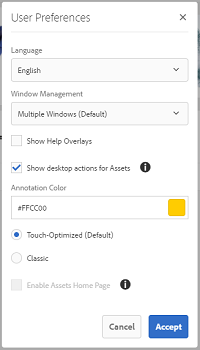

   *图：选择 [!UICONTROL Show Desktop Actions For Assets] 以启用桌面操作。*

## 浏览、搜索和预览资源 {#browse-search-preview-assets}

您可以浏览、搜索和预览中可用的资源 [!DNL Experience Manager] 存储库，全部来自桌面应用程序。 在应用程序中尝试以下操作：

1. 浏览到文件夹并查看文件夹中可用资源的一些基本信息，以及所有资源的小型缩略图。

   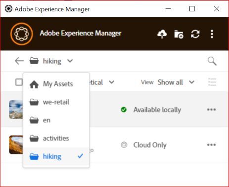

1. 要查看单个资产的更多信息和更大的缩略图，请单击文件名。

   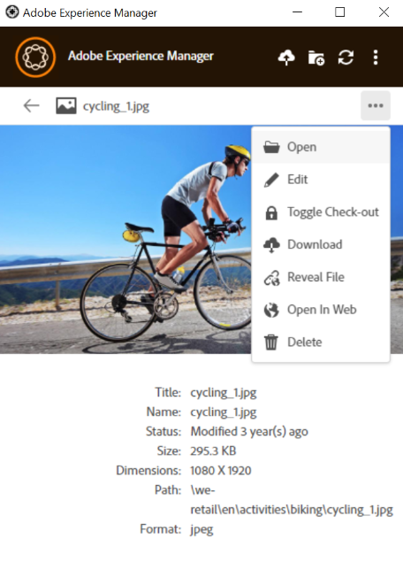

1. 单击 **[!UICONTROL Open]** 或 **[!UICONTROL Edit]** 若要从本地下载文件，则只需分别在本机应用程序中查看或编辑该文件。
1. 使用关键字搜索以在 [!DNL Experience Manager] 存储库。 使用 `?` 和 `*` 作为通配符。 这些通配符分别替换单个字符或多个字符。 根据需要筛选和排序结果。

   

   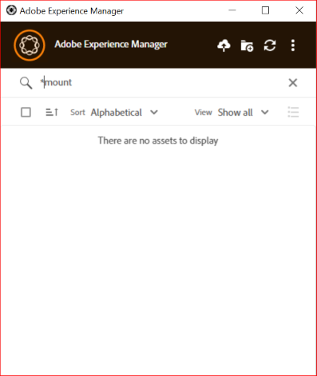

>[!NOTE]
>
>应用程序通过跨多个元数据字段匹配搜索条件来显示资源，而不只是资源的标题或文件名。

## 下载资源 {#download-assets}

您可以在本地文件系统上下载资产。 应用程序从以下位置获取资产 [!DNL Experience Manager] 并将相同的副本保存在本地文件系统中。

单击  ，然后单击  下载。

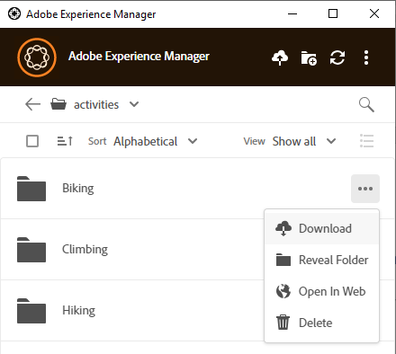

>[!NOTE]
>
>下载或上传大文件或许多文件时，应用程序会关闭对资源和文件夹的操作。 下载或上传完成后，这些操作将可用。

如果队列过大，或者遇到网络问题，下载多个资源可能会导致性能不佳。 此外，在下载文件夹时，您可能会无意中将许多资产排入下载队列。 为避免较长的等待时间，应用程序会限制单次下载的资产数量。 要了解如何对其进行配置，请参阅 [设置首选项](install-upgrade.md#set-preferences). 即使低于此限制，应用程序有时也可能在下载明显较大的文件夹之前寻求确认。

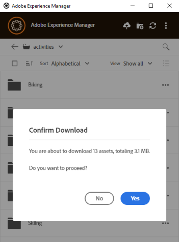

如果选择并下载文件夹，则应用程序仅下载直接存储在文件夹中的资产。 [!DNL Experience Manager]. 它不会自动从子文件夹下载资产。

## 在桌面上打开资产 {#openondesktop-v2}

您可以打开远程资产，以便在本机应用程序中查看。 资产将下载到本地文件夹，并在与文件格式关联的本机应用程序中启动。 您可以更改本机应用程序，以在Mac或Windows中打开特定的文件类型（扩展名）。

单击 **[!UICONTROL Open]** （从资产菜单）。 资产将下载到本地，并在本地应用程序中打开。 在状态栏中检查大型资产的下载进度和传输速度。

<!-- 
-->

>[!NOTE]
>
>如果应用程序未反映预期的更改，请单击刷新图标  或者右键单击应用程序界面，然后单击 **[!UICONTROL Refresh]**. 在大型下载或上传正在进行时，操作不可用。

要打开资源的本地下载文件夹，请单击  并单击  **[!UICONTROL Reveal File]** 操作。

## 使用资产或将资产放入本机文档 {#place-assets-in-native-documents}

在某些情况下，例如在将资源放入本机文档时，您可以在Windows资源管理器或Mac Finder中访问文件。 要访问本地下载文件的文件系统位置，请使用  **[!UICONTROL Reveal File]** 选项。

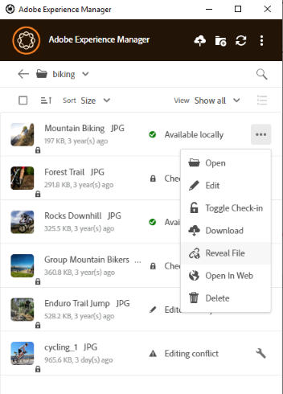

单击 **[!UICONTROL Reveal File]**，或 **[!UICONTROL Reveal Folder]** 在文件夹上，使用本地计算机上预先选定的文件或文件夹打开Windows资源管理器或Mac Finder。 此选项可用于（例如）放置 [!DNL Experience Manager] 本地应用程序中支持放置或链接本地文件的文件。 要了解如何在Adobe InDesign中放置文件，请参阅 [放置图形](https://helpx.adobe.com/indesign/using/placing-graphics.html).

此 **[!UICONTROL Reveal File]** 操作可打开本地网络共享，其中仅显示本地可用的资产，即显示使用应用程序显示、下载或打开/编辑的资产。 本地网络共享不会将任何更改上传到 [!DNL Experience Manager]. 要上传更改，请明确使用 **[!UICONTROL Upload Changes]** 或 **[!UICONTROL Upload]** 操作。

>[!NOTE]
>
>用于向后兼容 [!DNL Experience Manager] 桌面应用程序v1.x中，显示的文件来自本地网络共享，仅公开本地可用文件。 显示文件的桌面路径与应用程序v1.x创建的路径相同。

>[!CAUTION]
>
>不使用 **[!UICONTROL Reveal File]** 用于编辑本机应用程序中的资源的选项。 请改用 **[!UICONTROL Edit]** 操作。 要了解更多信息，请参阅 [高级工作流程：对相同文件进行协作并避免编辑冲突](#adv-workflow-collaborate-avoid-conflicts).

## 编辑资源并将更新的资源上传到 [!DNL Experience Manager] {#edit-assets-upload-updated-assets}

当您想要进行更改并将更新的资产上传到Experience Manager EM服务器时，请打开资产进行编辑。 要避免与其他用户的编辑发生冲突，请使用应用程序启动编辑会话。 在开始编辑之前，请确保资产上没有锁图标，即其他用户未编辑资产。

要编辑资源，请搜索资源或浏览到资源的位置。 单击  并单击 **[!UICONTROL Edit]**.

使用 **[!UICONTROL Toggle Check-out]** 锁定资产以防止在以下两种情况下与其他用户的编辑发生冲突：

* 您已开始编辑资产，但未先签出该资产（例如，只需打开它）。
* 您打算尽快开始编辑资产，不希望其他人编辑资产。

完成编辑后，应用程序会显示 **[!UICONTROL Edited Locally]** 已更改资产的状态。 在您将更改上传到之前，保存到资源的所有更改仅供本地使用 [!DNL Experience Manager]. 要逐个上传一个资产或几个资产，请单击 **[!UICONTROL Upload Changes]** 资源选项中的。 它会在中创建资源的版本 [!DNL Experience Manager]. 使用的Web界面 [!DNL Assets]中，您可以查看资源历史记录 [时间线视图](https://experienceleague.adobe.com/docs/experience-manager-65/assets/using/activity-stream.html).

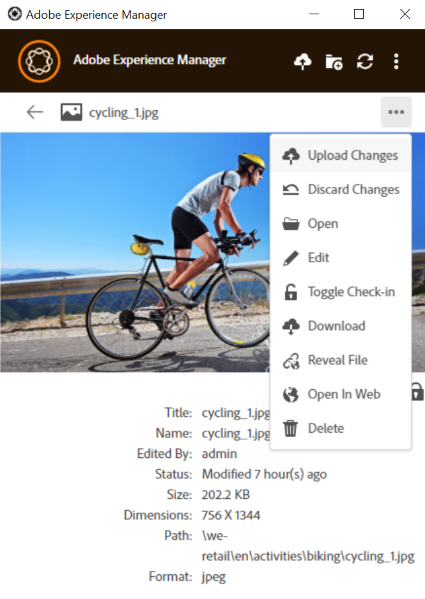

有关协作编辑的最佳实践，请参阅 [高级工作流程：对相同文件进行协作并避免编辑冲突](#adv-workflow-collaborate-avoid-conflicts).

在以下情况下，您可能需要放弃对本地资产的更改和编辑。 单击 **[!UICONTROL Discard Changes]**.

* 如果您不想将本地更改保存在 [!DNL Experience Manager].
* 保存一些更改后，开始更改原始资源。
* 停止编辑不再需要的资源。

如有必要，请切换签出。 更新的资产将从本地缓存文件夹中删除，并在编辑或打开时再次下载。

## 上传新资源并将其添加到 [!DNL Experience Manager] {#upload-and-add-new-assets-to-aem}

用户可以向DAM存储库添加新资产。 例如，您可能是一位机构摄影师或承包商，想要将照片拍摄中的大量照片添加到 [!DNL Experience Manager] 存储库。 要将新内容添加到 [!DNL Experience Manager]，选择  应用程序顶栏中的。 浏览到本地文件系统中的资源文件，然后单击 **[!UICONTROL Select]**. 或者，要上传资源，请将文件或文件夹拖动到应用程序界面上。 在Windows上，如果将资源拖动到应用程序内的文件夹中，则会将资源上传到该文件夹中。 如果上传时间较长，应用程序会显示进度条。

<!-- 
-->

您可以从本地文件系统上传文件夹或单个文件。 上传文件夹时，将保留该文件夹的层次结构。 在批量上传资产之前，请参阅 [批量上传](#bulk-upload-assets).

要查看给定会话中传输的资产列表，请单击 **[!UICONTROL View]** > **[!UICONTROL Assets transfers]**. 列表允许您查看和快速验证当前会话的文件传输。

您可以在中控制上传并发（加速） **[!UICONTROL Preferences]** > **[!UICONTROL Upload acceleration]** 设置。 并发性越强，上传速度通常越快，但可能会占用大量资源，从而消耗本地计算机的处理能力。 如果遇到系统速度较慢的情况，请使用较低的并发值重新尝试上传。

>[!NOTE]
>
>此传输列表不是永久性的，如果您退出应用程序然后重新打开它，则此列表将不可用。

### 管理资源名称中的特殊字符 {#special-characters-in-filename}

在旧版应用程序中，在存储库中创建的节点名称会保留用户提供的文件夹名称的空格和大小写。 要使当前应用程序模拟v1.10应用程序的节点命名规则，请启用 [!UICONTROL Use legacy conventions when creating nodes for assets and folders] 在 [!UICONTROL Preferences]. 请参阅 [应用程序首选项](/help/using/install-upgrade.md#set-preferences). 默认情况下，此旧版首选项处于禁用状态。

>[!NOTE]
>
>应用程序使用以下命名惯例仅更改存储库中的节点名称。 应用程序会保留 `Title` 资产的实际状况。

<!-- TBD: Do NOT use this table.

| Where do characters occur | Characters | Legacy preference | Renaming convention | Example |
|---|---|---|---|---|
| In file name extension | `.` | Enabled or disabled | Retained as is | NA |
| File or folder name | `. / : [ ] | *` | Enabled or disabled | Replaced with a `-` (hyphen) | `myimage.jpg` remains as is and `my.image.jpg` changes to `my-image.jpg`. |
| Folder name | `% ; # , + ? ^ { } "` | Disabled | Replaced with a `-` (hyphen) | tbd |
| File name | `% # ? { } &` | Disabled | Replaced with a `-` (hyphen) | tbd |
| File name | Whitespaces | Enabled or disabled | Retained as is | NA |
| Folder name | Whitespaces | Disabled | Replaced with a `-` (hyphen) | tbd |
| File name | Uppercase characters | Disabled | Retained as is | tbd |
| Folder name | Uppercase characters | Disabled | Replaced with a `-` (hyphen) | tbd |
-->

| 字符数 ‡ | 应用程序中的旧版偏好设置 | 当出现在文件名中时 | 当出现在文件夹名称中时 | 示例 |
|---|---|---|---|---|
| `. / : [ ] | *` | 启用或禁用 | 已替换为 `-` （连字符）。 A `.` 文件扩展名中的（点）将按原样保留。 | 已替换为 `-` （连字符）。 | `myimage.jpg` 保持不变，并且 `my.image.jpg` 更改为 `my-image.jpg`. |
| `% ; # , + ? ^ { } "` 和空格 |  已禁用 | 保留空格 | 已替换为 `-` （连字符）。 | `My Folder.` 更改为 `my-folder-`. |
| `# % { } ? & .` |  已禁用 | 已替换为 `-` （连字符）。 | NA. | `#My New File.` 更改为 `-My New File-`. |
| 大写字符 |  已禁用 | 外壳保持原样。 | 更改为小写字符。 | `My New Folder` 更改为 `my-new-folder`. |
| 大写字符 |  已启用 | 外壳保持原样。 | 外壳保持原样。 | NA. |

‡字符列表是以空格分隔的列表。

<!-- TBD: Check if the following is to be included in the footnote.

Do not use &#92;&#92; in the names of files and &#92;&#116; &#38; in the names of folders. 
-->

<!-- TBD: Securing the below presentation of the same content in a comment.

**File names**

| Characters | Replaced by |
|---|---|
| &#35; &#37; &#123; &#63; &#125; &#38; &#46; &#47; &#58; &#91; &#124; &#93; &#42; | hyphen (-) |
| whitespaces | whitespaces are retained |
| capital case | casing is retained |

>[!CAUTION]
>
>Avoid using &#92;&#92; in file names.

**Folder names**

| Characters | Replaced by |
|---|---|
| Characters | Replaced by |
| &#37; &#59; &#35; &#44; &#43; &#63; &#94; &#123; &#123; &#34; &#46; &#47; &#59; &#91; &#93; &#124; &#42; | hyphen (-) |
| whitespaces | hyphen (-) |
| capital case | lower case |

>[!CAUTION]
>
>Avoid using &#92;&#92; &#92;&#116; &#38; in folder names.

>[!NOTE]
>
>If you enable [!UICONTROL Use legacy conventions when creating nodes for assets and folders] in app [!UICONTROL Preferences], then the app emulates v1.10 app behavior when uploading folders. In v1.10, the node names created in the repository respect spaces and casing of the folder names provided by the user. For more information, see [app Preferences](/help/using/install-upgrade.md#set-preferences).

-->

## 使用多个资产 {#work-with-multiple-assets}

用户可以使用各种操作轻松处理和管理多个资源，例如一次性上传所有编辑内容或单击几下上传嵌套文件夹。

### 浏览大型文件夹 {#browse-large-folders}

使用包含许多资源的文件夹时，请滚动查看更多资源。 要使用键盘滚动，请按几次Tab键以选择顶部的资产。 请注意高亮显示的资产，以了解何时选择该资产。 现在，使用向下箭头键在资源列表中移动。

### 所选资产的快速操作 {#quick-actions-for-selected-assets}

单击几个资源的缩略图以选择资源。 要选择所有资源，请单击应用程序顶栏中的复选框。 这组操作共同适用于所有选定资产，并将显示在应用程序底部的工具栏中。

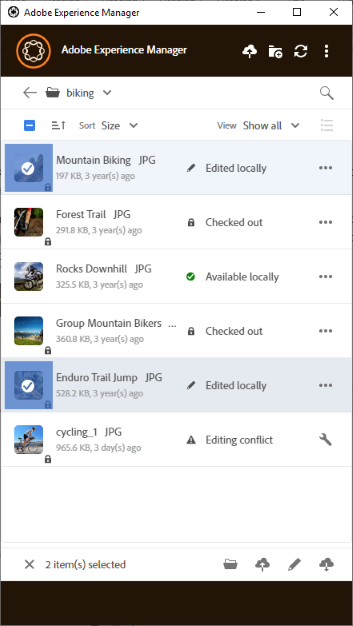

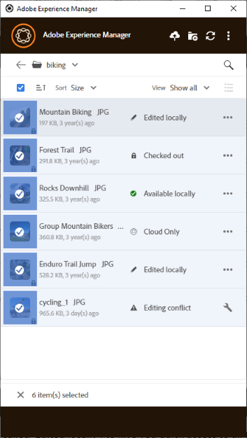

底部工具栏中的可用操作取决于所选文件的状态。 例如，如果仅选择 **[!UICONTROL Edited Locally]** 文件，您会看到 **[!UICONTROL Upload Changes]** 图标。 如果您选择 **[!UICONTROL Edited locally]** 和 **[!UICONTROL Cloud only]**， **[!UICONTROL Upload Changes]** 操作不可用。

### 查找所有已编辑的图像 {#find-all-edited-images}

应用程序提供了一个视图，名为 **[!UICONTROL Edited locally]**，以允许您快速访问本地下载的所有文件(通过 [!UICONTROL Open] 或 [!UICONTROL Edit] 操作)，然后进行修改。 该应用程序允许您选择所有本地编辑的资产并单击几下以上传更改。 此视图还会显示存在编辑冲突的本地编辑的资源。

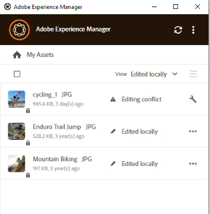

### 批量上传资产 {#bulk-upload-assets}

用户或组织（例如摄影师或创意公司）可以在场景中创建大量本地资产，例如照片拍摄、修饰或从外部完成的大集合中选择 [!DNL Experience Manager]. 他们可以将这些大型本地文件夹上传到 [!DNL Assets] 直接从桌面应用程序。 文件夹层次结构将保留，并且所有嵌套的子文件夹和包含的资产将上传。 上传的资产也可立即供同一服务器上的其他用户使用。 资产在后台上传，因此该操作不绑定到Web浏览器会话。

![将多个本地文件夹从桌面批量上传到 [!DNL Experience Manager]](assets/upload_local_folders_da2.png "将多个本地文件夹从桌面批量上传到Experience Manager中")

上传后，如果应用程序未反映预期的更改，请单击刷新图标 .

>[!NOTE]
>
>请勿使用上传功能跨两个迁移资产 [!DNL Experience Manager] 部署。 相反，请查看 [迁移指南](https://experienceleague.adobe.com/docs/experience-manager-65/assets/administer/assets-migration-guide.html).

### 已转移的资产列表 {#list-of-transferred-assets}

要查看给定会话中转移的资产列表，请参阅 [将资源上传到 [!DNL Experience Manager]](#upload-and-add-new-assets-to-aem).

## 高级工作流：从 [!DNL Assets] Web界面 {#adv-workflow-start-from-aem-ui}

如有必要，请从Assets Web界面启动工作流。 该桌面应用程序与 [!DNL Experience Manager] ，以便在收到使用桌面操作的请求时接管。

从Web界面启动工作流的一个特殊情况是资产发现。 Assets用户界面中的Omnisearch栏提供了丰富而高级的搜索体验。 您可能希望首先在Web上找到所需的资产，然后使用在应用程序中启动工作流 [!UICONTROL Desktop Actions]. 一些示例示例示例示例包括使用Facet筛选搜索结果、查找从Adobe Stock许可的特定资源，或由您的组织实施的自定义项，该自定义项允许您更好地从Web界面中发现。

当您尝试在Assets Web界面上进行以下操作时，将使用桌面应用程序功能：

* 此 [!UICONTROL Desktop Actions] 允许 [!UICONTROL Open]， [!UICONTROL Edit]、和 [!UICONTROL Reveal]
* [!UICONTROL Upload folder]
* [!UICONTROL Check-out] 或 [!UICONTROL check-in]

例如，对于在应用程序中签出的资产，Web界面上可用的操作包括 [!UICONTROL Open]， [!UICONTROL Reveal]、和 [!UICONTROL Check-in].

![中的桌面操作 [!DNL Experience Manager] Web界面](assets/assets_web_actions_da2.png "Experience ManagerWeb界面中的桌面操作")

>[!NOTE]
>
>浏览器可能会提示您允许启动 [!DNL Adobe Experience Manager] 桌面。 要享受从浏览器到应用程序的不中断传输，请选中相应的复选框以始终允许应用程序接管任务。

使用Web界面无法找到以下信息或工作流。 使用桌面应用程序，因为Web界面不跟踪本地更改，并且不知道以下内容：

* 在本地编辑的文件。
* 存在编辑冲突的文件以及解决该冲突的方法。
* 将本地更改上传到 [!DNL Experience Manager].
* 本地可用文件的各种状态。

相反，您可以从使用的桌面应用程序开始在Web界面中打开资产 **[!UICONTROL Open In Web]** 操作。

## 高级工作流程：对相同文件进行协作并避免编辑冲突 {#adv-workflow-collaborate-avoid-conflicts}

在协作环境中，多个用户可能使用一组相同的资产，这可能会导致版本冲突。 要防止冲突，请遵循以下最佳实践：

* 不要通过单击编辑任何资源 [!UICONTROL Open]. 不要通过从文件系统文件夹打开来编辑本地下载的资源。 其他用户不知道该资产正在编辑中。
* 要编辑资源，请始终单击 [!UICONTROL Edit]. 它将在本机应用程序中打开资产，并在资产上添加一个锁定图标，以便其他用户知道资产正在编辑中。
* 单击 [!UICONTROL Toggle Check-in] 如果您意外地开始编辑而未单击 [!UICONTROL Edit]. 此操作会向资产添加一个锁图标。 即使您计划稍后编辑资产但又希望避免其他用户编辑它，请单击 [!UICONTROL Toggle Check-in] 以锁定资产。
* 在编辑资源之前，请确保其他用户未编辑该资源。 在资源上查找锁图标。
* 完成编辑后，上传所有更改，然后签入资产。

如果本地下载的资源在 [!DNL Experience Manager] 服务器，则应用程序将显示 **[!UICONTROL Modified remotely]** 状态。 您可以通过单击来删除本地副本或刷新本地副本 [!UICONTROL Remove] 或 [!UICONTROL Update] 的量度。 利用对话框中的链接，可以查看资源的两个版本。

如果您正在本地编辑的资产也在您不知情的情况下在服务器上进行了更新，则应用程序将显示 **[!UICONTROL Editing Conflict]** 状态。 您可以保留一组更改 — 或者保留您的更新(单击 **[!UICONTROL Keep Mine]**)，并删除其他用户的编辑或遵循其他用户的更新，同时删除您的更新(**[!UICONTROL Overwrite Mine]**)。

## 高级工作流：在InDesign文件中放置和链接资源 {#adv-workflow-place-assets-indesign}

当您使用 [!DNL Experience Manager] 桌面应用程序打开包含链接资源的文件，资源会预先下载并显示在本机应用程序中。 要使此工作流正常工作，您的本机应用程序必须支持将链接放置到本地资产和 [!DNL Experience Manager] 必须支持将二进制文件中的这些链接解析为服务器端引用。

[!DNL Experience Manager] 桌面应用程序通过一些精选Adobe Creative Cloud桌面应用程序和文件格式(Adobe InDesign、Adobe Illustrator和Adobe Photoshop)支持此工作流程。 利用工作流，可高效地处理支持的Creative Cloud文件。 因此，如果用户A在InDesign文件中放置一些资源并将其签入 [!DNL Experience Manager]，用户B会看到InDesign文件中的资源，即使这些资源不是文件的一部分也是如此。 这些资产将在用户B的计算机上本地下载。

>[!NOTE]
>
>该桌面应用程序可以映射到Windows上的任何驱动器。 但是，为了顺利操作，请勿更改默认驱动器号。 如果同一组织的用户使用不同的驱动器号，则他们看不到其他用户放置的资产。 路径更改时，不会获取所放置的资产。 置入的资产将继续置于二进制文件（如INDD）中，并且不会被删除。

要了解此工作流的限制，请参阅 [系统要求和支持的版本](release-notes.md).

要使用图像资源和InDesign尝试此工作流，请执行以下步骤：

1. 在中保存包含已放置资产的INDD文件 [!DNL Experience Manager]. 要了解如何创建此类INDD文件，请参见 [放置图形](https://helpx.adobe.com/indesign/using/placing-graphics.html).
1. 从桌面应用程序中， **[!UICONTROL Edit]** 包含置入资源的INDD文件 [!DNL Experience Manager].
1. 该应用程序会下载InDesign文件和链接的资源。 当InDesign打开文档时，将解析链接，下载资源，并在InDesign文档中显示资源。
1. 要在InDesign文件中放置新图形，请使用 **[!UICONTROL Reveal File]** 对资产执行操作。 该操作将在本地下载资产，并在Windows资源管理器或Mac Finder中打开本地网络共享位置。
1. 将显示的资源放在InDesign文档中。 这会在文档中创建链接。
1. 在InDesign文档中完成编辑后，保存并将其上传到 [!DNL Experience Manager] 使用桌面应用程序。

## 高级工作流：在本地下载资产 {#adv-workflow-download-assets-locally}

应用程序从下载资产 [!DNL Experience Manager] 在许多情况下，会在文件系统中本地服务器。 下载占用带宽和磁盘空间。 了解这些情形有助于优化下载的等待时间。

您可以按需从应用程序中下载资产。 请参阅 [下载资产](#download-assets).

当您使用 [!UICONTROL Open] 操作在本机桌面应用程序中打开资产，如果资产在本地尚不可用，则会本地下载该资产。 请参阅 [打开资产](#openondesktop-v2).

当您从应用程序中揭示资产或文件夹的位置时，资产或文件夹会首先在本地下载，然后在本地网络共享中的计算机上打开。 请参阅 [打开资产](#openondesktop-v2).

当您使用 [!UICONTROL Edit] 操作在本机桌面应用程序中编辑资产，如果资产在本地尚不可用，则会本地下载该资产。 请参阅 [编辑资源并将更新的资源上传到 [!DNL Experience Manager]](#edit-assets-upload-updated-assets).

如果安装了应用程序并且它获准使用，则它会在您使用时完成操作 [!UICONTROL Desktop Actions] 从 [!DNL Experience Manager] web界面。 应用程序先下载资产，然后完成操作。
